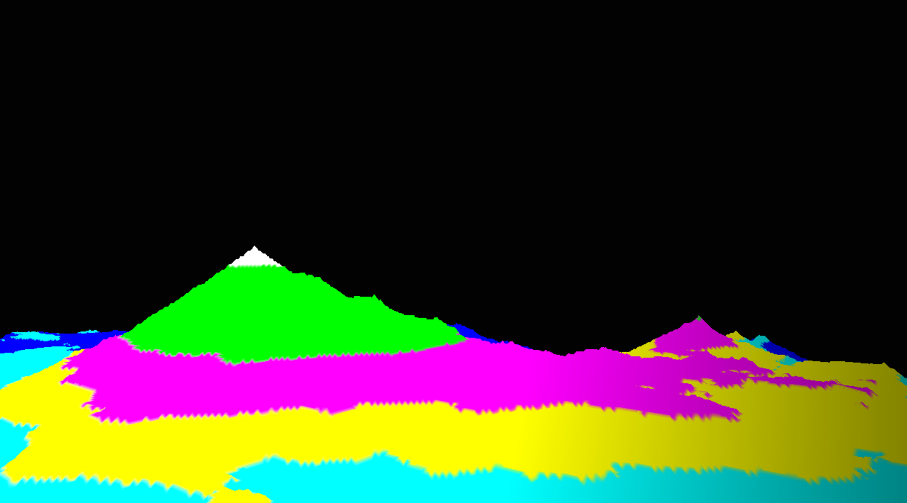
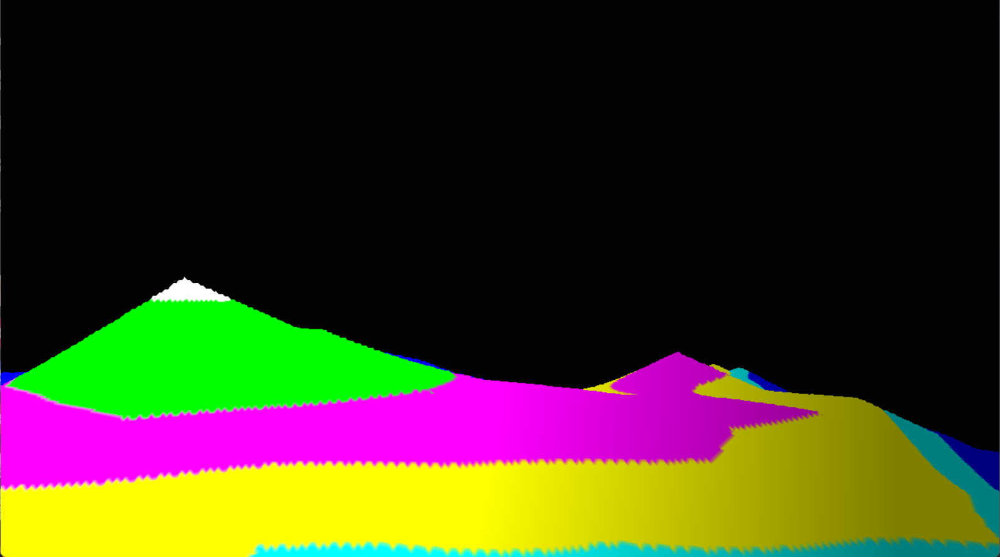
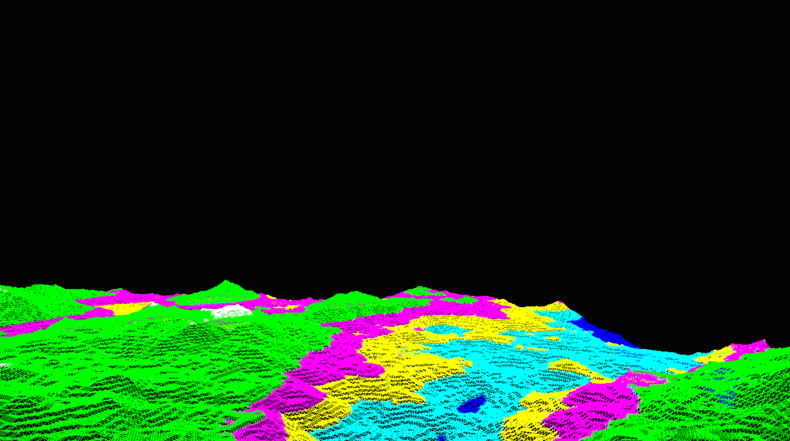

## Real Time Perlin Noise Generation

## YouTube/Dropbox/Drive Link: https://youtu.be/jj-pnDZxcgE

## Images:
* 
* 
* 
* 

## Controls:
* Use WASD to move the camera around, Q to go up and E to go down
* Use up and down arrows to modify terrain complexity
* Use R key to generate a new terrain
* Use the - and = keys to decrease and increase the scale of the terrain
* TAB to toggle wireframe mode

## References
  * *Used [this video tutorial](https://youtu.be/6-0UaeJBumA?si=Gr9vfR5ERfXHarV3) to figure out perlin noise generation, and applied it to OpenGL and allowed for more user input*
  * *Used Mike Shah's Terrain lab as a baseline to extend off of*
